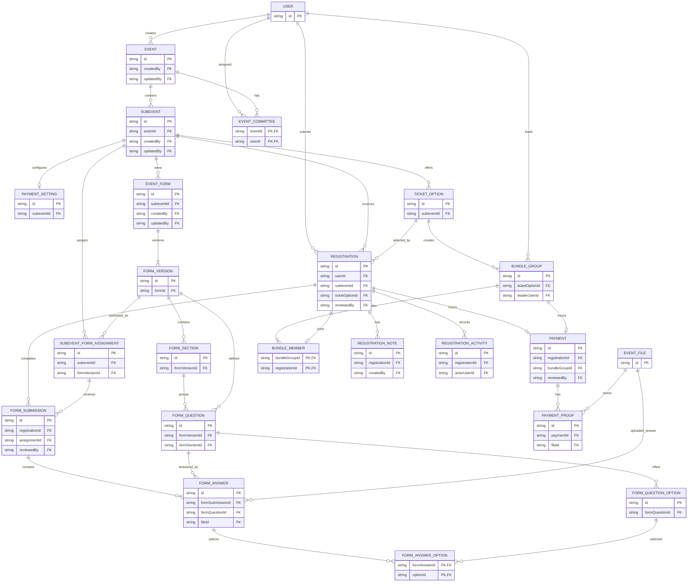

# Event Domain Schema And Migration Plan

## 1. Purpose

Align the backend event domain with the refactored frontend covering:

- Events and subevents
- Ticket options and bundles
- Registration forms and immutable versions
- Participant registrations and review
- Payments and proof history
- Internal notes and activity history
- Existing event committee relationships

This plan does not change authentication, RBAC, URL shortening, or user
management. Existing non-event tables remain unchanged except for incoming
foreign keys from event-domain tables.

## 2. Source Of Truth

The target contract is derived from:

- `src/types/events.ts`
- `src/data/events.ts`
- `src/pages/events/lifecycle.ts`
- Event and subevent pages
- Form builder and registration review pages
- Event lifecycle and route tests

The current Prisma event models and applied migrations describe the migration
source, not the final target.

## 3. Confirmed Business Flow

1. Create an event in `DRAFT`.
2. Create one or more subevents under a draft or published event.
3. Configure schedule, location, capacity, registration dates, ticket options,
   payment rules, and forms.
4. Publish required form versions.
5. Publish a subevent only when it has at least one ticket and every required
   form is publishable.
6. Publish an event with at least one valid selected subevent.
7. A participant selects a ticket and creates a registration.
8. Bundle registrations join through a reference code when applicable.
9. Required forms are submitted and payment proof is uploaded when required.
10. Committee reviewers independently review forms, payment, and bundle state.
11. The registration is confirmed, corrected, rejected, or cancelled.
12. Notes and activity entries preserve review history.
13. Closing cascades to published child resources.
14. Archiving preserves data and makes configuration read-only.

## 4. Lifecycle Policy

### Event And Subevent Target Statuses

- `DRAFT`
- `PUBLISHED`
- `CLOSED`
- `ARCHIVED`
- `CANCELLED` for preserved legacy or explicit future cancellation

Frontend lifecycle transitions:

- `DRAFT -> PUBLISHED`
- `DRAFT -> ARCHIVED`
- `PUBLISHED -> CLOSED`
- `CLOSED -> PUBLISHED`
- `CLOSED -> ARCHIVED`
- `ARCHIVED -> DRAFT`

`CANCELLED` remains terminal unless a separate recovery policy is approved.

### Editing Policy

- Event descriptive fields remain editable in draft, published, and closed
  states.
- Archived events are read-only.
- Full subevent configuration is editable only in draft.
- Published subevents permit a controlled field allowlist:
  - Capacity may increase but not fall below occupied capacity.
  - Registration close and edit-lock deadlines may be extended.
  - Private operational descriptions may be updated.
- Published form versions are immutable.

## 5. Target Entities

### Existing Entities Retained

- `User`: unchanged.
- `EventCommittee`: preserve `event_committees`, composite primary key
  `(eventId, userId)`, role, and assignment timestamp.

### Event And Configuration Entities

- `Event`
- `Subevent`
- `PaymentSetting`
- `TicketOption`
- `EventForm`
- `FormVersion`
- `FormSection`
- `FormQuestion`
- `FormQuestionOption`
- `SubeventFormAssignment`

### Operational Entities

- `Registration`
- `FormSubmission`
- `FormAnswer`
- `FormAnswerOption`
- `Payment`
- `PaymentProof`
- `EventFile`
- `BundleGroup`
- `BundleMember`
- `RegistrationNote`
- `RegistrationActivity`

## 6. Frontend-To-Database Mapping

| Frontend concept | Proposed database entity |
| --- | --- |
| Event | `Event` |
| Scheduled occurrence or region | `Subevent` |
| Event committee member | Existing `EventCommittee` |
| Registration and payment rules | `Subevent`, `PaymentSetting` |
| Individual or bundle ticket | `TicketOption` |
| Bundle invitation or group | `BundleGroup` |
| Bundle participant | `BundleMember` |
| Participant registration | `Registration` |
| Owned, versioned form | `EventForm`, `FormVersion` |
| Form layout | `FormSection`, `FormQuestion`, `FormQuestionOption` |
| Form assigned to a subevent | `SubeventFormAssignment` |
| Participant form completion | `FormSubmission` |
| Typed answer | `FormAnswer`, `FormAnswerOption` |
| Registration or bundle payment | `Payment` |
| Payment proof history | `PaymentProof` |
| Uploaded file metadata | `EventFile` |
| Reviewer note | `RegistrationNote` |
| Registration audit trail | `RegistrationActivity` |
| Frontend user projection | Existing `User` |

## 7. Proposed ERD



The payment cardinalities in this ERD intentionally show both candidate owners.
Only one ownership path should be enabled after the bundle payment decision is
made.

## 8. Key Schema Decisions

### Event

Retain the current table and IDs.

Fields:

- `id` PK
- `name` as `varchar(255)`
- nullable `publicDescription` as text
- nullable `coverImageUrl` as text
- `status`
- `createdAt`, `createdBy` FK to `User`
- nullable `updatedAt`, `updatedBy` FK to `User`

Indexes:

- `(status, updatedAt)`
- Optional case-insensitive search support after query requirements are known

### Subevent

Retain the current table and IDs, adding:

- `startsAt`
- `endsAt`
- nullable `locationAddress`
- nullable `capacity`
- non-null `maxTicketsPerUser`
- nullable `registrationOpensAt`
- nullable `registrationClosesAt`
- nullable `editLockAt`
- `autoConfirmWhenComplete`
- Target lifecycle status

Remove flattened ticket and payment fields only in the final contract phase.

Checks:

- `endsAt >= startsAt`
- Capacity is positive when present
- Ticket limit is positive
- Registration close is not earlier than registration open

Indexes:

- `(eventId, status)`
- `startsAt`
- `(registrationOpensAt, registrationClosesAt)`

### Event Committee

Preserve the physical `event_committees` table and:

- Composite PK `(eventId, userId)`
- Existing role values, including `ADVISOR`
- `assignedAt`
- Existing foreign-key behavior

A Prisma-only model spelling correction from `EventComittee` to
`EventCommittee` may use `@@map("event_committees")`; it must not rename or
rebuild the database table.

### Payment Setting

One optional configuration per subevent.

Fields and constraints:

- `id` PK
- `subeventId` FK and unique
- `isPaymentRequired`
- Nullable bank, account name, account number, instructions, and proof deadline
- Accepted MIME types as a PostgreSQL text array or JSON
- Nullable maximum file size

Account number must be a string, never an integer. Bank destination fields are
conditionally required by application validation when payment is enabled.

### Ticket Option

- `id` PK
- `subeventId` FK
- Name and nullable description
- `type`: `INDIVIDUAL` or `BUNDLE`
- Price as `Decimal(19,4)`
- ISO 4217 currency string
- Nullable `bundleSize`, capacity, and sales window
- Ticket lifecycle status

Checks:

- Price is nonnegative.
- Capacity is positive when present.
- Bundle size is at least two for bundle tickets and null for individual
  tickets.

Indexes:

- `(subeventId, status)`
- `(subeventId, salesOpensAt, salesClosesAt)`

Historical registrations retain ticket-name, price, and final-amount snapshots.

### Forms

Forms are owned by one subevent and cannot be shared between subevents.

- `EventForm` stores identity, purpose, lifecycle, ownership, and audit fields.
- `FormVersion` stores immutable version boundaries.
- Sections, questions, and options belong to a version.
- `SubeventFormAssignment` pins the version and stores completion stage,
  required/blocking behavior, order, availability, and due date.
- Old assignments and versions remain available to historical submissions.

Required uniqueness:

- `(formId, versionNumber)`
- `(formVersionId, fieldKey)`
- `(formVersionId, section orderIndex)`
- `(formQuestionId, option value)`
- `(formQuestionId, option orderIndex)`
- `(subeventId, assignment orderIndex)`
- `(subeventId, formVersionId)` where duplicate assignment is not meaningful

`validationConfig` should use nullable `jsonb` for type-specific limits and
validation rules.

### Registration

A registration belongs to one existing user, one subevent, and one ticket
option. It stores:

- `id` PK
- `userId`, `subeventId`, and `ticketOptionId` FKs
- Ticket name snapshot
- Price and final amount snapshots as decimals
- Registration status
- Nullable correction reason
- Nullable submitted, confirmed, edited, and reviewed timestamps
- Nullable `reviewedBy` FK to `User`
- Created and updated timestamps

Indexes:

- `(subeventId, status)`
- `(userId, subeventId)`
- `(ticketOptionId, status)`
- `submittedAt`

Do not add `UNIQUE(userId, subeventId)` until ticket multiplicity is resolved.

### Form Submissions And Answers

- One submission per registration and assigned form version.
- Submissions store lifecycle, correction reason, edit/review timestamps, and
  nullable reviewer FK.
- Typed answer columns support text, decimal, boolean, timestamp, and file.
- Selected options use `FormAnswerOption` rather than arrays or JSON.
- Published question labels and options remain available through immutable
  versions.

Constraints:

- Unique `(registrationId, assignmentId)` on submissions.
- Unique `(formSubmissionId, formQuestionId)` on answers.
- Composite PK `(formAnswerId, optionId)` on selected options.
- Validate that answer questions belong to the submission's pinned version.

### Payment

The target must support amount snapshots, proof history, rejection reasons, and
reviewer auditing.

Final ownership is a decision gate:

- Registration-owned payment; or
- Bundle-owned payment for bundle tickets and registration-owned payment for
  individual tickets.

Do not duplicate the full bundle amount onto every member unless that is the
confirmed accounting policy. Whichever ownership model is selected must enforce
exactly one owner using foreign keys and a database check.

### Files And Proofs

- Store file metadata independently from public URLs.
- Payment proofs reference file records and preserve replacement history.
- Enforce one current proof per payment with a partial unique PostgreSQL index.
- Index `(paymentId, uploadedAt)`.
- Do not make SHA-256 globally unique without an approved deduplication policy.
- Confirm whether payment proof access must use private signed URLs.

### Bundles

- A bundle group references a bundle ticket.
- `referenceCode` is globally unique.
- Required member count and total price are snapshotted.
- Membership uses composite PK `(bundleGroupId, registrationId)`.
- `registrationId` is also unique so a registration cannot join two groups.
- Exactly one leader must be enforced transactionally or with a partial index.
- Bundle member registrations must use the group's ticket and subevent.

Indexes:

- `(ticketOptionId, status)`
- Unique `referenceCode`

### Notes And Activity

- Notes are internal reviewer content.
- Activity records are append-only.
- Both reference existing users only through nullable or required foreign keys.
- Index both tables by `(registrationId, createdAt)`.

## 9. Target Enums

Define enums matching the frontend contract while retaining legacy values during
migration where necessary:

- Event and subevent lifecycle status
- `SubeventType`
- `TicketType`
- `TicketStatus`
- `FormStatus`
- `FormVersionStatus`
- `FormPurpose`
- `FormCompletionStage`
- `FormFieldType`
- `RegistrationStatus`
- `FormSubmissionStatus`
- `PaymentStatus`
- `BundleStatus`
- `BundleMemberRole`
- `RegistrationActivityType`

Preserve the existing `CommitteeRole` enum unchanged.

## 10. Current Schema Gaps

- `Subevent.date` cannot represent start and end.
- `SubeventStatus.OPEN` does not match the frontend `PUBLISHED` lifecycle.
- `EventStatus` has `CANCELLED` but lacks frontend `ARCHIVED`.
- Flattened subevent price cannot represent multiple tickets.
- Flattened payment configuration cannot represent proof history.
- Integer account numbers lose leading zeros and may overflow.
- `EventHasParticipant` combines registration, approval, payment, and proof.
- Its redundant event and subevent references can become inconsistent.
- Registration records lack ticket and amount snapshots.
- Bundle groups and membership do not exist.
- Forms have no immutable versions or sections.
- Existing forms have limited metadata and assignment rules.
- Answers cannot reliably store typed values or multiple selected options.
- Form submissions lack correction and review states.
- Notes and activity history do not exist.
- Event and subevent status/filter queries lack explicit indexes.
- Existing migrations introduced some required fields without safe nullable and
  backfill phases.

## 11. Migration Strategy

Do not edit applied migrations. Implement all changes through new reviewed
migrations using an expand, backfill, cutover, and contract sequence.

### Phase 0: Decisions And Production Inventory

Before schema implementation:

- Count all event-domain rows and status values.
- Detect inconsistent participant `eventId` versus subevent parent event.
- Detect duplicate participant rows.
- Inventory payment proof URLs and form answer shapes.
- Inventory nullable and invalid subevent payment fields.
- Decide bundle payment ownership.
- Decide the meaning of `maxTicketsPerUser`.
- Decide the explicit policy for legacy `CANCELLED`.
- Decide whether a short event-domain write freeze is acceptable.
- Establish rollback criteria and the backup/restore owner.

Deliverables:

- Data-quality report
- Approved status mapping
- Approved monetary and bundle semantics
- Backfill and rollback runbook

### Phase 1: Expand

- Add new enum values without removing old values.
- Add replacement subevent columns as nullable.
- Create ticket, payment-setting, registration, payment, bundle,
  versioned-form, file, note, and activity tables.
- Preserve all legacy columns and tables.
- Add user foreign keys without changing the user table.
- Add only constraints that existing and empty target tables can satisfy.
- Generate Prisma Client and review migration SQL.

Rollback: application continues using the legacy model; unused additive tables
and columns can remain harmlessly in place.

### Phase 2: Backfill Configuration

- Copy `date` to `startsAt`.
- Set `endsAt` to `date` only as an explicit unknown-duration fallback and
  record affected rows for correction.
- Copy `maxParticipants` to capacity.
- Copy `maxTicketsPerUser`, applying a documented fallback where null.
- Copy `autoAcceptRegistration` to automatic confirmation.
- Convert each subevent's flattened price into a default ticket using an
  approved rule for `priceModifier`.
- Convert flattened payment fields into one payment setting.
- Convert account numbers to strings.
- Preserve legacy visibility and checkout data until ownership is confirmed.

### Phase 3: Backfill Forms

- Create one owned event form for every legacy registration form.
- Create immutable version 1.
- Create a default section.
- Copy questions and options while preserving IDs where practical.
- Create one assignment for version 1.
- Convert responses to submissions.
- Convert scalar answers conservatively.
- Report ambiguous checkbox, selected-option, and file data rather than
  silently discarding it.

### Phase 4: Backfill Registrations And Payments

- Validate participant event/subevent consistency.
- Quarantine inconsistent rows for manual resolution.
- Create one registration per valid legacy participant.
- Attach the generated default ticket.
- Snapshot ticket name and amount.
- Map registration and payment statuses through an explicit mapping table.
- Create payment and proof/file records where legacy proof URLs exist.
- Store old-to-new ID mappings for reconciliation and rollback.

Suggested status mapping must be approved before execution. A likely starting
point is:

| Legacy status | Target status |
| --- | --- |
| Registration `PENDING` | `PENDING_REVIEW` |
| Registration `APPROVED` | `CONFIRMED` |
| Registration `REJECTED` | `REJECTED` |
| Registration `CANCELLED` | `CANCELLED` |
| Payment `UNPAID` | `AWAITING_UPLOAD` or `NOT_REQUIRED` based on settings |
| Payment `SUBMITTED` | `PENDING_REVIEW` |
| Payment `VERIFIED` | `APPROVED` |
| Payment `REJECTED` | `REJECTED` |
| Response `DRAFT` | `DRAFT` |
| Response `SUBMITTED` | `SUBMITTED` or `PENDING_REVIEW` |
| Response `LOCKED` | `APPROVED` only if legacy semantics confirm approval |

### Phase 5: Reconciliation

Validate:

- Source and target row counts
- No orphaned event-domain records
- All registration user, subevent, and ticket links
- Amount totals by event and subevent
- Form response and answer counts
- Status distributions
- Payment proof URL preservation
- Event committee row equality
- No writes to unrelated tables

Migration must stop before cutover if reconciliation fails.

### Phase 6: Application Cutover

Recommended approach:

1. Temporarily freeze event-domain writes.
2. Run the final delta backfill.
3. Re-run reconciliation.
4. Deploy backend repositories and APIs using the new model.
5. Run targeted smoke tests.
6. Re-enable event-domain writes.

If a write freeze is impossible, design transactional dual writes and a
reconciliation worker before migration. Do not improvise dual writes during
implementation.

### Phase 7: Tighten Constraints

Only after valid backfill:

- Make replacement subevent fields required where appropriate.
- Add unique constraints.
- Add check constraints.
- Add partial unique indexes.
- Add final query indexes.
- Preserve legacy tables as read-only rollback sources.

### Phase 8: Contract Cleanup

In a separate later release:

- Remove old flattened subevent fields.
- Retire `event_has_participants`.
- Retire old form, response, and answer tables.
- Remove obsolete enum values only when PostgreSQL and historical data permit.
- Retain archival exports before destructive changes.

Cleanup is not part of the first production cutover and requires separate
approval.

## 12. API And Frontend Work Order

1. Finalize schema decisions and API DTOs.
2. Implement event and subevent reads and lifecycle transitions.
3. Implement ticket and payment-setting management.
4. Implement versioned form builder and publishing.
5. Implement registration creation and form submission.
6. Implement payment upload and review.
7. Implement bundle joining and validation.
8. Implement registration review, notes, and activity.
9. Replace frontend mock store operations with API queries and mutations.
10. Keep server authorization and lifecycle validation authoritative.

Every backend feature should follow the existing route, controller, service,
repository, schema, types, and OpenAPI structure.

## 13. Backward Compatibility And Rollback

- Preserve existing IDs or map them explicitly.
- Existing endpoints may use translation DTOs during cutover.
- Legacy statuses must remain readable.
- Old tables remain available for rollback until a later cleanup migration.
- Committee behavior and table structure remain unchanged.
- No foreign key should cascade from event records into deletion of users.
- Event cancellation and archive are state transitions, not hard deletion.
- Rollback before cleanup means deploying the previous application against the
  retained legacy tables.
- Rollback after new writes begin requires a reverse synchronization strategy;
  therefore cleanup must wait until the rollback window closes.

## 14. Data Migration Risks

- A single legacy timestamp cannot reconstruct the actual event duration.
- Legacy `CANCELLED` does not mean the same thing as frontend `ARCHIVED`.
- Flattened price fields do not identify ticket or bundle intent.
- Existing account numbers may already have lost leading zeros.
- Legacy proof URLs lack reliable file metadata and replacement history.
- Scalar answer columns may not preserve multiple-choice semantics.
- Published form version boundaries cannot be reconstructed historically.
- Inconsistent event and subevent references may block foreign keys.
- Duplicate participant rows may block registration uniqueness decisions.
- Dual writing complex form and payment state could diverge.
- Cascading event deletion could destroy financial and review history.
- Making constraints required before reconciliation could make deployment fail.

## 15. Blocking Questions

1. Is a bundle paid once by the group, or separately by every member?
2. Does ticket capacity count admissions or purchased ticket records?
3. What does `maxTicketsPerUser > 1` create: quantity on one registration or
   multiple registration records?
4. Should explicit cancellation remain available in the new UI?
5. What fallback duration should be used for legacy subevents with one
   timestamp?
6. Can event-domain writes be paused for the final migration?
7. Where are uploaded files stored, and are payment proofs private or public?
8. Are post-registration forms allowed to receive submissions after a
   registration is confirmed?
9. Must reviewers approve each form submission separately, or is form review
   represented only by overall registration status?
10. Should registration confirmation require payment, every blocking form, and
    bundle validation in one server-side transaction?
11. Does the legacy `checkOutToken` belong to the retained subevent model or a
    future attendance/check-in domain?
12. Is subevent visibility still required even though the refactored frontend
    does not expose it?

## 16. Acceptance Criteria

- The frontend event lifecycle can be represented without lossy status mapping.
- Every frontend event-domain type has a persistent backend representation.
- Published forms and historical registration snapshots remain immutable.
- Payments and proofs preserve review and replacement history.
- Bundle membership and capacity rules are transactionally enforceable.
- Existing committee rows and access behavior remain unchanged.
- No unrelated table is altered by event-domain migrations.
- Backfill reconciliation is complete before application cutover.
- Legacy tables remain available through the rollback window.
- Cleanup occurs only through a later, separately approved migration.

## 17. Proposed Target Prisma Schema

This is the canonical target schema for the proposed ERD. It is a design
artifact, not a migration to paste directly into the current schema in one
release. The expand phase may need temporary Prisma model names while legacy
models coexist, followed by a contract migration that adopts these final names.

The existing `User` model and all unrelated models must remain in place. Only
merge the relation fields shown in the `User` excerpt into the existing model.

All business timestamps below use PostgreSQL `timestamptz`. Before converting
existing `timestamp` columns, the migration must explicitly confirm the timezone
used by legacy data.

```prisma
// ==========================================
// EVENT DOMAIN ENUMS
// ==========================================

enum EventStatus {
   DRAFT
   PUBLISHED
   CLOSED
   ARCHIVED
   CANCELLED
}

enum SubeventStatus {
   DRAFT
   PUBLISHED
   CLOSED
   ARCHIVED
   CANCELLED
}

enum SubeventType {
   MAIN_EVENT
   WORKSHOP
   SEMINAR
   COMPETITION
   WELCOMING_PARTY
   DOMESTIC_STUDY_TOUR
   INTERNATIONAL_STUDY_TOUR
   COMPANY_VISIT
   OTHER
}

enum TicketType {
   INDIVIDUAL
   BUNDLE
}

enum TicketStatus {
   DRAFT
   ACTIVE
   INACTIVE
   SOLD_OUT
   ARCHIVED
}

enum FormStatus {
   DRAFT
   PUBLISHED
   CLOSED
   ARCHIVED
}

enum FormVersionStatus {
   DRAFT
   PUBLISHED
   ARCHIVED
}

enum FormPurpose {
   MAIN_REGISTRATION
   TRANSPORTATION
   ACCOMMODATION
   ADDITIONAL_INFORMATION
   OTHER
}

enum FormCompletionStage {
   DURING_REGISTRATION
   POST_REGISTRATION
}

enum FormFieldType {
   SHORT_TEXT
   LONG_TEXT
   EMAIL
   PHONE
   NUMBER
   DATE
   TIME
   DROPDOWN
   SINGLE_CHOICE
   MULTIPLE_CHOICE
   CHECKBOX
   FILE_UPLOAD
   IMAGE_UPLOAD
   INFORMATION
}

enum RegistrationStatus {
   DRAFT
   SUBMITTED
   PENDING_REVIEW
   REQUIRES_CORRECTION
   CONFIRMED
   REJECTED
   CANCELLED
}

enum FormSubmissionStatus {
   DRAFT
   SUBMITTED
   PENDING_REVIEW
   APPROVED
   REQUIRES_CORRECTION
}

enum PaymentStatus {
   NOT_REQUIRED
   AWAITING_UPLOAD
   PENDING_REVIEW
   APPROVED
   REJECTED
}

enum BundleStatus {
   WAITING_FOR_MEMBERS
   PENDING_VALIDATION
   APPROVED
   REJECTED
   CANCELLED
}

enum BundleMemberRole {
   LEADER
   MEMBER
}

enum RegistrationActivityType {
   REGISTRATION_CREATED
   REGISTRATION_SUBMITTED
   ANSWERS_EDITED
   REVIEW_REQUESTED
   REGISTRATION_APPROVED
   REGISTRATION_REJECTED
   CORRECTION_REQUESTED
   PAYMENT_APPROVED
   PAYMENT_REJECTED
   BUNDLE_APPROVED
   BUNDLE_REJECTED
   NOTE_ADDED
}

// Preserve the existing enum and values. It is repeated here only so the
// target event-domain fragment is self-contained.
enum CommitteeRole {
   ADVISOR
   CHAIRPERSON
   VICE_CHAIRPERSON
   SECRETARY
   TREASURER
   COORDINATOR
   STAFF
}

// ==========================================
// MERGE ONLY THESE RELATIONS INTO User
// ==========================================

model User {
   // Keep every existing User scalar and relation field unchanged.
   id String @id

   createdEvents    Event[] @relation("EventCreator")
   updatedEvents    Event[] @relation("EventUpdater")
   createdSubevents Subevent[] @relation("SubeventCreator")
   updatedSubevents Subevent[] @relation("SubeventUpdater")

   eventCommittees EventCommittee[] @relation("EventCommitteeUser")

   createdEventForms EventForm[] @relation("EventFormCreator")
   updatedEventForms EventForm[] @relation("EventFormUpdater")

   eventRegistrations    Registration[] @relation("RegistrationParticipant")
   reviewedRegistrations Registration[] @relation("RegistrationReviewer")
   reviewedSubmissions   FormSubmission[] @relation("FormSubmissionReviewer")
   reviewedPayments      Payment[] @relation("PaymentReviewer")

   ledBundleGroups       BundleGroup[] @relation("BundleLeader")
   registrationNotes     RegistrationNote[] @relation("RegistrationNoteAuthor")
   registrationActivities RegistrationActivity[]
      @relation("RegistrationActivityActor")

   @@map("users")
}

// ==========================================
// EVENTS AND SUBEVENTS
// ==========================================

model Event {
   id                String      @id @default(nanoid())
   name              String      @db.VarChar(255)
   publicDescription String?     @db.Text
   coverImageUrl     String?     @db.Text
   status            EventStatus @default(DRAFT)

   createdAt DateTime  @default(now()) @db.Timestamptz(3)
   createdBy String    @db.VarChar(100)
   updatedAt DateTime? @updatedAt @db.Timestamptz(3)
   updatedBy String?   @db.VarChar(100)

   creator User  @relation("EventCreator", fields: [createdBy], references: [id], onDelete: Restrict)
   updater User? @relation("EventUpdater", fields: [updatedBy], references: [id], onDelete: SetNull)

   subevents   Subevent[]
   committees EventCommittee[]

   @@index([status, updatedAt])
   @@map("events")
}

model Subevent {
   id                 String         @id @default(nanoid())
   eventId            String
   name               String         @db.VarChar(255)
   publicDescription  String?        @db.Text
   privateDescription String?        @db.Text
   type               SubeventType
   startsAt           DateTime       @db.Timestamptz(3)
   endsAt             DateTime       @db.Timestamptz(3)
   locationName       String?        @db.VarChar(255)
   locationAddress    String?        @db.Text
   locationUrl        String?        @db.Text
   capacity           Int?
   maxTicketsPerUser  Int            @default(1)
   registrationOpensAt  DateTime?    @db.Timestamptz(3)
   registrationClosesAt DateTime?    @db.Timestamptz(3)
   editLockAt           DateTime?    @db.Timestamptz(3)
   autoConfirmWhenComplete Boolean   @default(false)
   status             SubeventStatus @default(DRAFT)

   // Retain legacy visibility/check-in fields during expand and cutover if
   // production inventory confirms they are still used.
   visibility    SubeventVisibility @default(PUBLIC)
   checkOutToken String?            @db.VarChar(255)

   createdAt DateTime  @default(now()) @db.Timestamptz(3)
   createdBy String    @db.VarChar(100)
   updatedAt DateTime? @updatedAt @db.Timestamptz(3)
   updatedBy String?   @db.VarChar(100)

   event   Event @relation(fields: [eventId], references: [id], onDelete: Restrict)
   creator User  @relation("SubeventCreator", fields: [createdBy], references: [id], onDelete: Restrict)
   updater User? @relation("SubeventUpdater", fields: [updatedBy], references: [id], onDelete: SetNull)

   paymentSetting PaymentSetting?
   ticketOptions  TicketOption[]
   forms          EventForm[]
   formAssignments SubeventFormAssignment[]
   registrations Registration[]

   @@index([eventId, status])
   @@index([startsAt])
   @@index([registrationOpensAt, registrationClosesAt])
   @@map("subevents")
}

// This corrects only the Prisma model spelling. @@map preserves the existing
// physical table and no table rename is required.
model EventCommittee {
   eventId    String
   userId     String
   role       CommitteeRole @default(STAFF)
   assignedAt DateTime      @default(now()) @db.Timestamptz(3)

   event Event @relation(fields: [eventId], references: [id], onDelete: Cascade)
   user  User  @relation("EventCommitteeUser", fields: [userId], references: [id], onDelete: Cascade)

   @@id([eventId, userId])
   @@index([userId])
   @@map("event_committees")
}

// ==========================================
// TICKETS AND PAYMENT CONFIGURATION
// ==========================================

model PaymentSetting {
   id                       String   @id @default(nanoid())
   subeventId               String   @unique
   isPaymentRequired        Boolean  @default(false)
   bankName                 String?  @db.VarChar(100)
   accountName              String?  @db.VarChar(100)
   accountNumber            String?  @db.VarChar(100)
   paymentInstructions      String?  @db.Text
   proofDeadline            DateTime? @db.Timestamptz(3)
   acceptedMimeTypes        String[] @default([])
   maximumFileSizeBytes     Int?
   createdAt                DateTime @default(now()) @db.Timestamptz(3)
   updatedAt                DateTime? @updatedAt @db.Timestamptz(3)

   subevent Subevent @relation(fields: [subeventId], references: [id], onDelete: Restrict)

   @@map("event_payment_settings")
}

model TicketOption {
   id           String       @id @default(nanoid())
   subeventId   String
   name         String       @db.VarChar(255)
   description  String?      @db.Text
   type         TicketType
   price        Decimal      @db.Decimal(19, 4)
   currency     String       @default("IDR") @db.Char(3)
   bundleSize   Int?
   capacity     Int?
   salesOpensAt DateTime?    @db.Timestamptz(3)
   salesClosesAt DateTime?   @db.Timestamptz(3)
   status       TicketStatus @default(DRAFT)
   createdAt    DateTime     @default(now()) @db.Timestamptz(3)
   updatedAt    DateTime?    @updatedAt @db.Timestamptz(3)

   subevent     Subevent      @relation(fields: [subeventId], references: [id], onDelete: Restrict)
   registrations Registration[]
   bundleGroups  BundleGroup[]

   @@index([subeventId, status])
   @@index([subeventId, salesOpensAt, salesClosesAt])
   @@map("event_ticket_options")
}

// ==========================================
// VERSIONED FORM BUILDER
// ==========================================

model EventForm {
   id          String      @id @default(nanoid())
   subeventId  String
   name        String      @db.VarChar(255)
   description String?     @db.Text
   purpose     FormPurpose
   status      FormStatus  @default(DRAFT)

   createdAt DateTime  @default(now()) @db.Timestamptz(3)
   createdBy String    @db.VarChar(100)
   updatedAt DateTime? @updatedAt @db.Timestamptz(3)
   updatedBy String?   @db.VarChar(100)

   subevent Subevent @relation(fields: [subeventId], references: [id], onDelete: Restrict)
   creator User      @relation("EventFormCreator", fields: [createdBy], references: [id], onDelete: Restrict)
   updater User?     @relation("EventFormUpdater", fields: [updatedBy], references: [id], onDelete: SetNull)

   versions FormVersion[]

   // Supports a compound FK that guarantees each version retains the owning
   // form's subevent.
   @@unique([id, subeventId])
   @@index([subeventId, status])
   @@map("event_forms")
}

model FormVersion {
   id            String            @id @default(nanoid())
   formId        String
   subeventId    String
   versionNumber Int
   status        FormVersionStatus @default(DRAFT)
   publishedAt   DateTime?         @db.Timestamptz(3)
   createdAt     DateTime          @default(now()) @db.Timestamptz(3)

   form EventForm @relation(fields: [formId, subeventId], references: [id, subeventId], onDelete: Cascade)

   sections    FormSection[]
   assignments SubeventFormAssignment[]

   @@unique([formId, versionNumber])
   @@unique([id, subeventId])
   @@index([formId, status])
   @@map("event_form_versions")
}

model FormSection {
   id            String  @id @default(nanoid())
   formVersionId String
   title         String  @db.VarChar(255)
   description   String? @db.Text
   orderIndex    Int

   version   FormVersion   @relation(fields: [formVersionId], references: [id], onDelete: Cascade)
   questions FormQuestion[]

   @@unique([id, formVersionId])
   @@unique([formVersionId, orderIndex])
   @@map("event_form_sections")
}

model FormQuestion {
   id               String        @id @default(nanoid())
   formVersionId    String
   formSectionId    String
   label            String        @db.VarChar(255)
   fieldKey         String        @db.VarChar(100)
   fieldType        FormFieldType
   helpText         String?       @db.Text
   placeholder      String?       @db.VarChar(255)
   isRequired       Boolean       @default(false)
   validationConfig Json?         @db.JsonB
   orderIndex       Int

   section FormSection @relation(fields: [formSectionId, formVersionId], references: [id, formVersionId], onDelete: Cascade)
   options FormQuestionOption[]
   answers FormAnswer[]

   @@unique([formVersionId, fieldKey])
   @@unique([formSectionId, orderIndex])
   @@index([formVersionId])
   @@map("event_form_questions")
}

model FormQuestionOption {
   id             String  @id @default(nanoid())
   formQuestionId String
   label          String  @db.VarChar(255)
   value          String  @db.VarChar(255)
   orderIndex     Int
   isActive       Boolean @default(true)

   question       FormQuestion      @relation(fields: [formQuestionId], references: [id], onDelete: Cascade)
   selectedAnswers FormAnswerOption[]

   @@unique([formQuestionId, value])
   @@unique([formQuestionId, orderIndex])
   @@map("event_form_question_options")
}

model SubeventFormAssignment {
   id              String              @id @default(nanoid())
   subeventId      String
   formVersionId   String
   purpose         FormPurpose
   completionStage FormCompletionStage
   isRequired      Boolean             @default(true)
   blocksConfirmation Boolean          @default(true)
   orderIndex      Int
   availableFrom   DateTime?           @db.Timestamptz(3)
   dueAt           DateTime?           @db.Timestamptz(3)
   createdAt       DateTime            @default(now()) @db.Timestamptz(3)

   subevent Subevent @relation(fields: [subeventId], references: [id], onDelete: Restrict)
   version  FormVersion @relation(fields: [formVersionId, subeventId], references: [id, subeventId], onDelete: Restrict)

   submissions FormSubmission[]

   @@unique([subeventId, formVersionId])
   @@unique([subeventId, orderIndex])
   @@index([subeventId, completionStage])
   @@map("subevent_form_assignments")
}

// ==========================================
// REGISTRATIONS AND FORM SUBMISSIONS
// ==========================================

model Registration {
   id                  String             @id @default(nanoid())
   userId              String
   subeventId          String
   ticketOptionId      String
   ticketNameSnapshot  String             @db.VarChar(255)
   priceSnapshot       Decimal            @db.Decimal(19, 4)
   finalAmountSnapshot Decimal            @db.Decimal(19, 4)
   currencySnapshot    String             @default("IDR") @db.Char(3)
   status              RegistrationStatus @default(DRAFT)
   correctionReason    String?            @db.Text
   submittedAt         DateTime?          @db.Timestamptz(3)
   confirmedAt         DateTime?          @db.Timestamptz(3)
   lastEditedAt        DateTime?          @db.Timestamptz(3)
   lastReviewedAt      DateTime?          @db.Timestamptz(3)
   reviewedBy          String?
   createdAt           DateTime           @default(now()) @db.Timestamptz(3)
   updatedAt           DateTime?          @updatedAt @db.Timestamptz(3)

   user      User         @relation("RegistrationParticipant", fields: [userId], references: [id], onDelete: Restrict)
   subevent  Subevent     @relation(fields: [subeventId], references: [id], onDelete: Restrict)
   ticket    TicketOption @relation(fields: [ticketOptionId], references: [id], onDelete: Restrict)
   reviewer  User?        @relation("RegistrationReviewer", fields: [reviewedBy], references: [id], onDelete: SetNull)

   formSubmissions FormSubmission[]
   payment         Payment?
   bundleMembership BundleMember?
   notes            RegistrationNote[]
   activities       RegistrationActivity[]

   @@index([subeventId, status])
   @@index([userId, subeventId])
   @@index([ticketOptionId, status])
   @@index([submittedAt])
   @@map("event_registrations")
}

model FormSubmission {
   id               String               @id @default(nanoid())
   registrationId   String
   assignmentId     String
   status           FormSubmissionStatus @default(DRAFT)
   correctionReason String?              @db.Text
   submittedAt      DateTime?            @db.Timestamptz(3)
   lastEditedAt     DateTime?            @db.Timestamptz(3)
   reviewedAt       DateTime?            @db.Timestamptz(3)
   reviewedBy       String?
   createdAt        DateTime             @default(now()) @db.Timestamptz(3)
   updatedAt        DateTime?            @updatedAt @db.Timestamptz(3)

   registration Registration           @relation(fields: [registrationId], references: [id], onDelete: Restrict)
   assignment   SubeventFormAssignment @relation(fields: [assignmentId], references: [id], onDelete: Restrict)
   reviewer     User?                  @relation("FormSubmissionReviewer", fields: [reviewedBy], references: [id], onDelete: SetNull)

   answers FormAnswer[]

   @@unique([registrationId, assignmentId])
   @@index([assignmentId, status])
   @@map("event_form_submissions")
}

model FormAnswer {
   id               String   @id @default(nanoid())
   formSubmissionId String
   formQuestionId   String
   textValue        String?  @db.Text
   numberValue      Decimal? @db.Decimal(19, 4)
   booleanValue     Boolean?
   dateTimeValue    DateTime? @db.Timestamptz(3)
   fileId           String?
   createdAt        DateTime @default(now()) @db.Timestamptz(3)
   updatedAt        DateTime? @updatedAt @db.Timestamptz(3)

   submission FormSubmission @relation(fields: [formSubmissionId], references: [id], onDelete: Cascade)
   question   FormQuestion   @relation(fields: [formQuestionId], references: [id], onDelete: Restrict)
   file       EventFile?     @relation(fields: [fileId], references: [id], onDelete: Restrict)

   selectedOptions FormAnswerOption[]

   @@unique([formSubmissionId, formQuestionId])
   @@index([formQuestionId])
   @@index([fileId])
   @@map("event_form_answers")
}

model FormAnswerOption {
   formAnswerId String
   optionId     String

   answer FormAnswer         @relation(fields: [formAnswerId], references: [id], onDelete: Cascade)
   option FormQuestionOption @relation(fields: [optionId], references: [id], onDelete: Restrict)

   @@id([formAnswerId, optionId])
   @@index([optionId])
   @@map("event_form_answer_options")
}

// ==========================================
// PAYMENTS, FILES, AND BUNDLES
// ==========================================

model EventFile {
   id           String   @id @default(nanoid())
   storageKey   String?  @unique @db.Text
   publicUrl    String?  @db.Text
   originalName String   @db.VarChar(255)
   mimeType     String   @db.VarChar(255)
   sizeBytes    Int
   sha256       String?  @db.Char(64)
   createdAt    DateTime @default(now()) @db.Timestamptz(3)

   formAnswers  FormAnswer[]
   paymentProofs PaymentProof[]

   @@index([sha256])
   @@map("event_files")
}

// Payment ownership is intentionally flexible until the blocking bundle
// payment decision is made. Custom SQL must enforce exactly one non-null owner.
model Payment {
   id             String        @id @default(nanoid())
   registrationId String?       @unique
   bundleGroupId  String?       @unique
   baseAmount     Decimal       @db.Decimal(19, 4)
   expectedAmount Decimal       @db.Decimal(19, 4)
   currency       String        @default("IDR") @db.Char(3)
   status         PaymentStatus @default(AWAITING_UPLOAD)
   rejectionReason String?      @db.Text
   reviewedAt     DateTime?     @db.Timestamptz(3)
   reviewedBy     String?
   createdAt      DateTime      @default(now()) @db.Timestamptz(3)
   updatedAt      DateTime?     @updatedAt @db.Timestamptz(3)

   registration Registration? @relation(fields: [registrationId], references: [id], onDelete: Restrict)
   bundleGroup  BundleGroup?  @relation(fields: [bundleGroupId], references: [id], onDelete: Restrict)
   reviewer     User?         @relation("PaymentReviewer", fields: [reviewedBy], references: [id], onDelete: SetNull)

   proofs PaymentProof[]

   @@index([status, reviewedAt])
   @@map("event_payments")
}

model PaymentProof {
   id         String    @id @default(nanoid())
   paymentId  String
   fileId     String
   isCurrent  Boolean   @default(true)
   uploadedAt DateTime  @default(now()) @db.Timestamptz(3)
   replacedAt DateTime? @db.Timestamptz(3)

   payment Payment   @relation(fields: [paymentId], references: [id], onDelete: Restrict)
   file    EventFile @relation(fields: [fileId], references: [id], onDelete: Restrict)

   @@unique([paymentId, fileId])
   @@index([paymentId, uploadedAt])
   @@index([fileId])
   @@map("event_payment_proofs")
}

model BundleGroup {
   id                 String       @id @default(nanoid())
   ticketOptionId     String
   leaderUserId       String
   referenceCode      String       @unique @db.VarChar(100)
   requiredMemberCount Int
   totalPriceSnapshot Decimal      @db.Decimal(19, 4)
   currencySnapshot   String       @default("IDR") @db.Char(3)
   status             BundleStatus @default(WAITING_FOR_MEMBERS)
   rejectionReason    String?      @db.Text
   createdAt           DateTime     @default(now()) @db.Timestamptz(3)
   updatedAt           DateTime?    @updatedAt @db.Timestamptz(3)

   ticket TicketOption @relation(fields: [ticketOptionId], references: [id], onDelete: Restrict)
   leader User         @relation("BundleLeader", fields: [leaderUserId], references: [id], onDelete: Restrict)

   members BundleMember[]
   payment Payment?

   @@index([ticketOptionId, status])
   @@map("event_bundle_groups")
}

model BundleMember {
   bundleGroupId  String
   registrationId String @unique
   role            BundleMemberRole @default(MEMBER)
   joinedAt        DateTime @default(now()) @db.Timestamptz(3)

   bundleGroup  BundleGroup  @relation(fields: [bundleGroupId], references: [id], onDelete: Restrict)
   registration Registration @relation(fields: [registrationId], references: [id], onDelete: Restrict)

   @@id([bundleGroupId, registrationId])
   @@map("event_bundle_members")
}

// ==========================================
// REVIEW NOTES AND ACTIVITY
// ==========================================

model RegistrationNote {
   id             String   @id @default(nanoid())
   registrationId String
   content        String   @db.Text
   createdBy      String?
   createdAt      DateTime @default(now()) @db.Timestamptz(3)

   registration Registration @relation(fields: [registrationId], references: [id], onDelete: Restrict)
   creator      User?        @relation("RegistrationNoteAuthor", fields: [createdBy], references: [id], onDelete: SetNull)

   @@index([registrationId, createdAt])
   @@map("event_registration_notes")
}

model RegistrationActivity {
   id             String                   @id @default(nanoid())
   registrationId String
   type           RegistrationActivityType
   description    String                   @db.Text
   metadata       Json?                    @db.JsonB
   actorUserId    String?
   createdAt      DateTime                 @default(now()) @db.Timestamptz(3)

   registration Registration @relation(fields: [registrationId], references: [id], onDelete: Restrict)
   actor        User?        @relation("RegistrationActivityActor", fields: [actorUserId], references: [id], onDelete: SetNull)

   @@index([registrationId, createdAt])
   @@index([type, createdAt])
   @@map("event_registration_activities")
}
```

### PostgreSQL Constraints Not Expressible In Prisma

Prisma models do not represent all required checks and partial indexes. Add
equivalent SQL to the reviewed migration after the relevant data is backfilled.
Exact enum casts and constraint names should be adapted to the generated SQL.

```sql
ALTER TABLE "subevents"
ADD CONSTRAINT "subevents_valid_schedule_check"
CHECK ("endsAt" >= "startsAt"),
ADD CONSTRAINT "subevents_positive_capacity_check"
CHECK ("capacity" IS NULL OR "capacity" > 0),
ADD CONSTRAINT "subevents_positive_ticket_limit_check"
CHECK ("maxTicketsPerUser" > 0),
ADD CONSTRAINT "subevents_valid_registration_window_check"
CHECK (
  "registrationOpensAt" IS NULL
  OR "registrationClosesAt" IS NULL
  OR "registrationClosesAt" >= "registrationOpensAt"
);

ALTER TABLE "event_ticket_options"
ADD CONSTRAINT "event_ticket_options_nonnegative_price_check"
CHECK ("price" >= 0),
ADD CONSTRAINT "event_ticket_options_positive_capacity_check"
CHECK ("capacity" IS NULL OR "capacity" > 0),
ADD CONSTRAINT "event_ticket_options_bundle_size_check"
CHECK (
  ("type" = 'BUNDLE' AND "bundleSize" >= 2)
  OR ("type" = 'INDIVIDUAL' AND "bundleSize" IS NULL)
),
ADD CONSTRAINT "event_ticket_options_valid_sales_window_check"
CHECK (
  "salesOpensAt" IS NULL
  OR "salesClosesAt" IS NULL
  OR "salesClosesAt" >= "salesOpensAt"
);

ALTER TABLE "event_payments"
ADD CONSTRAINT "event_payments_exactly_one_owner_check"
CHECK (num_nonnulls("registrationId", "bundleGroupId") = 1),
ADD CONSTRAINT "event_payments_nonnegative_amounts_check"
CHECK ("baseAmount" >= 0 AND "expectedAmount" >= 0);

ALTER TABLE "event_files"
ADD CONSTRAINT "event_files_nonnegative_size_check"
CHECK ("sizeBytes" >= 0);

ALTER TABLE "event_bundle_groups"
ADD CONSTRAINT "event_bundle_groups_member_count_check"
CHECK ("requiredMemberCount" >= 2),
ADD CONSTRAINT "event_bundle_groups_nonnegative_total_check"
CHECK ("totalPriceSnapshot" >= 0);

ALTER TABLE "event_registrations"
ADD CONSTRAINT "event_registrations_nonnegative_amounts_check"
CHECK ("priceSnapshot" >= 0 AND "finalAmountSnapshot" >= 0);

ALTER TABLE "event_form_answers"
ADD CONSTRAINT "event_form_answers_single_scalar_shape_check"
CHECK (
  num_nonnulls(
    "textValue",
    "numberValue",
    "booleanValue",
    "dateTimeValue",
    "fileId"
  ) <= 1
);

CREATE UNIQUE INDEX "event_payment_proofs_one_current_per_payment_key"
ON "event_payment_proofs" ("paymentId")
WHERE "isCurrent" = true;

CREATE UNIQUE INDEX "event_bundle_members_one_leader_per_group_key"
ON "event_bundle_members" ("bundleGroupId")
WHERE "role" = 'LEADER';
```

The partial bundle leader index enforces at most one leader, not at least one.
Creating a bundle and its leader membership must therefore occur in one
transaction. Services must also verify that bundle registrations use the same
ticket and subevent as their group, and that submitted answers belong to the
form version pinned by their assignment.

## 18. Verification

For every implementation phase:

```bash
npx prisma validate
npx prisma generate
npm run build
npx eslint src --ext .ts
npx prettier . --check
```

Review every generated migration before committing it. Do not edit applied
migrations, use `prisma db push`, or run destructive reset commands.

Add migration-specific SQL reconciliation queries for:

- Source and target counts
- Orphan detection
- Duplicate detection
- Status mapping
- Monetary totals
- Proof preservation
- Form response and answer totals
- Verification that unrelated tables were not changed

The backend `npm test` command remains a placeholder and must not be reported as
passing.
